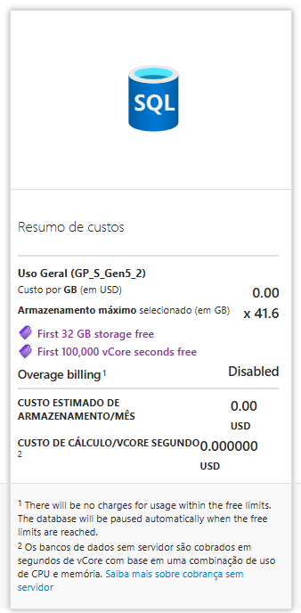
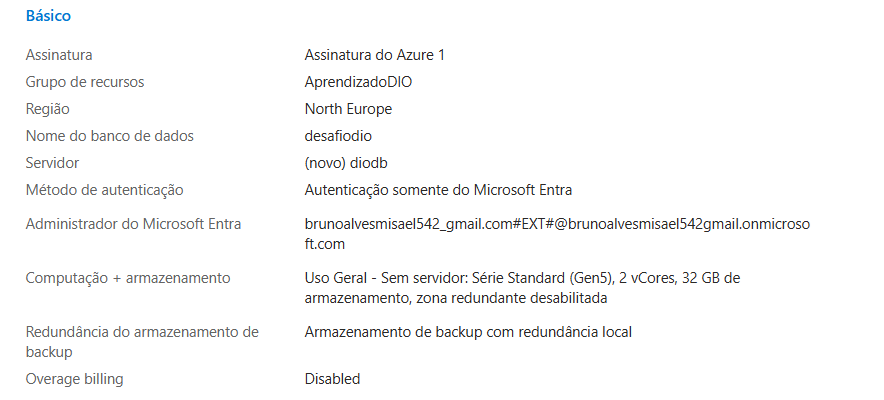
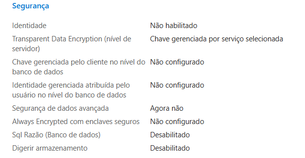
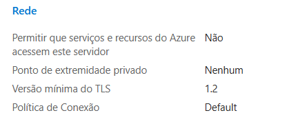
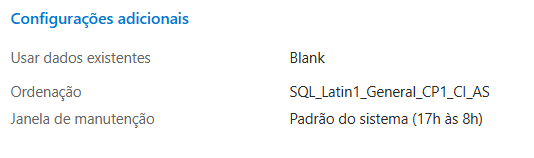

# Desafio DIO - Configuração de Instância SQL na Azure

Este repositório documenta o processo de criação e configuração de uma instância de banco de dados SQL na plataforma Microsoft Azure, como parte do desafio prático da DIO.

## 📌 Informações da Instância

- **Nome do Banco de Dados:** desafioDIO  
- **Servidor:** diodb.database.windows.net  
- **Região:** North Europe  
- **Grupo de Recursos:** AprendizadoDIO  
- **Armazenamento:** 32 GB (uso gratuito)  
- **vCores:** 2 (uso gratuito até 100.000 segundos)  
- **Autenticação:** Microsoft Entra  
- **Backup:** Redundância local  
- **Custo Estimado:** Gratuito dentro dos limites de uso

## 🔒 Segurança

- Transparent Data Encryption: Ativado (chave gerenciada pelo serviço)
- TLS mínimo: 1.2
- Identidade gerenciada: Desativada
- Segurança avançada: Não configurada

## 🛠️ Configurações Adicionais

- Dados existentes: Blank  
- Ordenação: SQL_Latin1_General_CP1_CI_AS  
- Janela de manutenção: 17h às 8h  

## 📸 Capturas de Tela

### Produto (Resumo de custos e uso)

### Configurações Básicas

### Segurança

### Rede

### Configurações Adicionais

